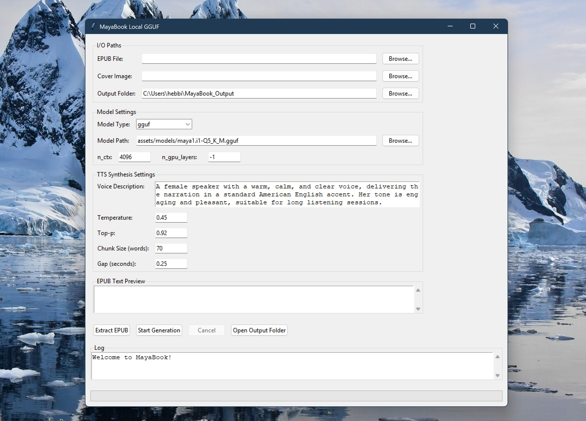

# **MayaBook**

**EPUB → TTS → MP4/M4B Audiobook Generator**

MayaBook is a work in progress application that converts EPUB books into high-quality narrated audiobooks (MP4/M4B formats).
It uses the **[Maya1](https://huggingface.co/maya-research/maya1)** voice model running locally via **GGUF quantized models** and `llama-cpp-python` to generate expressive, human-like speech with GPU acceleration.



**Version:** 2.0 Enhanced Edition
**Status:** Works mostly...

---

## ✨ **Overview**

**Input:** EPUB file(s)
**Process:** extract text → synthesize with local Maya1 GGUF → generate WAV audio → merge → create MP4/M4B
**Output:** Professional audiobook with chapters, metadata, and cover art

### Key Features

* **100% Local Processing** - No cloud services, API keys, or internet required
* **GPU Acceleration** - Automatic GPU detection with intelligent VRAM management
* **Voice Presets Library** - 15+ curated professional voices with instant preview
* **Batch Processing** - Queue multiple books for overnight processing
* **Chapter Support** - Automatic chapter detection with M4B export
* **Configuration Profiles** - Genre-specific presets (Fiction, Non-Fiction, Poetry, etc.)
* **Advanced Audio Tools** - Normalization, silence detection, speech rate control
* **Smart Defaults** - Auto-detection of models, files, and optimal settings
* **Expressive Speech** - Emotion tag support (`<laugh>`, `<cry>`, `<angry>`, etc.)

---

## 🧠 **How It Works**

1. **Extract Text**
   The app reads an EPUB, cleans it to plain text, and splits it into small chunks (recommended: 70-80 words per chunk for optimal TTS quality and to avoid token limit issues).

2. **Generate Audio Locally**
   Each chunk is synthesized using either:

   **GGUF Model (Recommended)** via `llama-cpp-python`:
   * Fast GPU-accelerated inference with CUDA
   * Uses quantized models (Q4_K_M, Q5_K_M, Q8_0)
   * Lower VRAM usage (~6-8GB for Q5_K_M)
   * Proven stable for production use

   **HuggingFace Transformers (Experimental)** via `transformers` + `bitsandbytes`:
   * 4-bit quantized safetensor models
   * Higher quality potential with full precision weights
   * Requires more VRAM (~10-12GB)
   * Supports emotion tags and advanced prompting
   * **Note**: As of 2025-11-14, HF implementation fixed with proper EOS token handling

   For both methods:
   * The model generates SNAC audio tokens from text and voice description
   * SNAC codec decodes tokens into 24 kHz audio waveforms
   * Each chunk is saved as a temporary WAV file
   * Multi-threaded synthesis processes multiple chunks in parallel
   * Supports **emotion tags** like `<laugh>`, `<cry>`, `<angry>` for expressive speech (see [EMOTION_TAGS.md](EMOTION_TAGS.md))

3. **Combine Audio**
   All chunk WAVs are concatenated into a single `book.wav`, with configurable silence gaps between chunks.

4. **Export MP4**
   A cover image is combined with the audio using FFmpeg:

   ```bash
   ffmpeg -loop 1 -i cover.jpg -i book.wav \
          -c:v libx264 -tune stillimage -c:a aac -b:a 192k \
          -shortest output.mp4
   ```

---

## 🖥️ **GUI Features**

### Standard Edition (`app.py`)
* **File Selection:** EPUB, cover image, model, output folder pickers
* **Voice Presets:** 15+ professional voices with instant preview playback
* **GGUF Configuration:** Context size, GPU layers
* **Synthesis Controls:** Temperature, top-p, chunk size, silence gaps
* **Real-time Progress:** Progress bar with completion percentage
* **Threaded Execution:** Non-blocking UI with cancel support
* **M4B Export:** Chapter-aware audiobook format with metadata

### Enhanced Edition (`ui/main_window_enhanced.py`)
**All standard features plus:**
* **GPU Auto-Detection:** Real-time VRAM monitoring with optimal settings
* **Smart File Detection:** Auto-locate models, EPUBs, and cover images
* **Configuration Profiles:** 6 built-in genre presets + custom profiles
* **Batch Processing:** Queue multiple books with individual settings
* **Enhanced Progress:** ETA, speed metrics, chunk-level tracking
* **Keyboard Shortcuts:** Ctrl+D (defaults), Ctrl+G (generate), Ctrl+E (extract)
* **Advanced Audio:** Pronunciation dictionary, normalization, silence trimming
* **Menu System:** Profile management, GPU tools, batch queue

All implemented with **Tkinter** for zero-dependency cross-platform compatibility.

---

## ⚙️ **Dependencies**

### Core Python Packages (Required)

```bash
ebooklib          # EPUB parsing
beautifulsoup4    # HTML text extraction
llama-cpp-python  # GGUF model inference (GPU-accelerated)
snac              # Maya1 audio codec
soundfile         # WAV file I/O
numpy             # Audio processing
torch             # GPU operations
platformdirs      # Cross-platform config storage
pygame            # Audio preview playback
```

### Optional Packages (Enhanced Features)

```bash
librosa           # Advanced audio processing (speech rate, analysis)
transformers      # HuggingFace model support (experimental)
bitsandbytes      # 4-bit quantization (Linux only)
accelerate        # Multi-GPU support
```

### System Requirements

* **Python:** 3.10+ (tested with 3.13)
* **FFmpeg:** Required in PATH for MP4/M4B export
* **GPU:** NVIDIA CUDA-compatible GPU strongly recommended
  - VRAM: 8GB+ for Q5_K_M model
  - CPU-only mode supported but 50x slower
* **Storage:** ~20GB for model + temp files during synthesis
* **OS:** Windows 10/11, Linux, macOS (Intel/Apple Silicon)

### Model Files (Download Separately)

* **Maya1 GGUF Model** (~12-15GB) - **Recommended for most users**
  - Download: [https://huggingface.co/maya-research/maya1](https://huggingface.co/maya-research/maya1)
  - Recommended: `maya1.i1-Q5_K_M.gguf` (best quality/speed balance, ~15GB)
  - Alternative: `maya1.i1-Q4_K_M.gguf` (faster, lower VRAM, slightly lower quality, ~12GB)
  - Higher quants: `maya1.i1-Q8_0.gguf` (maximum quality, ~25GB, slower)

* **Maya1 HuggingFace Model** (~6-8GB) - **Experimental, for advanced users**
  - Download: [https://huggingface.co/maya-research/maya1](https://huggingface.co/maya-research/maya1) (safetensor format)
  - Uses 4-bit quantization via bitsandbytes (Linux only)
  - Requires transformers, accelerate, bitsandbytes packages
  - Select "huggingface" model type in GUI
  - **Known Issue**: Full-book processing may have quality issues; best for testing/experimentation

---

## 🚀 **Installation**

### 1. Clone the Repository

```bash
git clone https://github.com/hebbihebb/MayaBook
cd MayaBook
```

### 2. Set Up Python Environment

```bash
python -m venv .venv
source .venv/bin/activate    # Linux/Mac
# OR
.venv\Scripts\activate       # Windows

pip install --upgrade pip
pip install -r requirements.txt
```

### 3. Install GPU-Accelerated llama-cpp-python (Recommended)

**For NVIDIA GPUs with CUDA 12.1+:**
```bash
pip install llama-cpp-python --extra-index-url https://abetlen.github.io/llama-cpp-python/whl/cu121
```

**For other CUDA versions:**
- CUDA 11.8: Replace `cu121` with `cu118`
- CPU-only: Skip this step (default CPU version will be used)

### 4. Install Optional Enhanced Features

```bash
pip install pygame      # Voice preview playback (recommended)
pip install librosa     # Advanced audio processing (optional)
```

### 5. Download the Maya1 GGUF Model

**Option A: Manual Download**
1. Visit: https://huggingface.co/maya-research/maya1
2. Download: `maya1.i1-Q5_K_M.gguf` (~15GB)
3. Place in: `assets/models/maya1.i1-Q5_K_M.gguf`

**Option B: Command Line (with huggingface-cli)**
```bash
pip install huggingface-hub
mkdir -p assets/models
cd assets/models
huggingface-cli download maya-research/maya1 maya1.i1-Q5_K_M.gguf --local-dir .
```

### 6. Verify Installation

```bash
# Test model detection
python -c "from core.gpu_utils import get_gpu_info; print(get_gpu_info())"

# Test FFmpeg
ffmpeg -version

# Launch GUI
python app.py
```

---

## ▶️ **Usage**

### Quick Start (Standard Edition)

1. **Launch the Application**
   ```bash
   python app.py
   ```

2. **First-Time Setup**
   - Select your EPUB file
   - Choose a cover image (auto-detected if named similarly to EPUB)
   - Browse to the GGUF model file (or use auto-detected path)
   - Select output folder

3. **Choose a Voice**
   - Use the **Voice Presets** dropdown to select from 15+ professional voices:
     - Professional Female Narrator
     - Authoritative Male (Morgan Freeman-style)
     - Young Adult Female (Energetic)
     - Distinguished British Male
     - Soothing Female (Bedtime Stories)
     - And more...
   - Click **Preview Voice** to hear a sample before generating

4. **Configure Settings** (Optional)
   - **Temperature:** 0.45 (default) - Controls creativity (0.3-0.5 recommended)
   - **Top-p:** 0.92 (default) - Nucleus sampling (0.88-0.95 recommended)
   - **Chunk Size:** 70 words (default) - Prevents token overflow
   - **Gap:** 0.25s (default) - Silence between chunks

5. **Generate Audiobook**
   - Click **Extract EPUB** to preview text
   - Click **Start Generation** to begin synthesis
   - Monitor progress bar and log output
   - Use **Cancel** to stop if needed

6. **Output Files**
   - **MP4:** Video file with cover image + audio
   - **M4B:** Audiobook format with chapters (if detected)
   - **WAV:** Raw audio file
   - Click **Open Output Folder** to access files

### Quick Start (Enhanced Edition)

1. **Launch Enhanced GUI**
   ```bash
   python -c "from ui.main_window_enhanced import EnhancedMainWindow; EnhancedMainWindow().mainloop()"
   ```

2. **Auto-Configure**
   - Press **Ctrl+D** to load smart defaults (auto-detects all files)
   - Click **Auto-Configure GPU** in GPU Status section
   - Select a **Configuration Profile** (Fiction, Non-Fiction, etc.)

3. **Batch Processing** (Optional)
   - Menu → File → Batch Processing
   - Add multiple EPUBs to queue
   - Configure individual settings per book
   - Click **Start Batch** for overnight processing

### Advanced Features

**Emotion Tags** - Add expressiveness to narration:
```
The crowd erupted. <laugh>This was incredible!</laugh>
She looked away. <cry>I can't believe it's over.</cry>
He slammed his fist down. <angry>Enough!</angry>
```
See [EMOTION_TAGS.md](EMOTION_TAGS.md) for full list.

**Pronunciation Dictionary** - Fix difficult words:
```python
from core.audio_advanced import PronunciationDictionary
pron_dict = PronunciationDictionary()
pron_dict.add("Hermione", "Her-my-oh-nee")
```

**Configuration Profiles** - Save/load complete settings:
- Menu → Profiles → Save Current as Profile
- Quick-switch via dropdown

---

## 🧩 **Project Structure**

```
MayaBook/
│
├─ app.py                          # Main GUI entry point (standard edition)
├─ test_cli.py                     # CLI testing tool
├─ diagnose_audio.py               # Audio quality analysis tool
├─ requirements.txt                # Python dependencies
│
├─ core/                           # Core processing modules
│   ├─ maya1_constants.py          # SNAC token constants
│   ├─ tts_maya1_local.py          # GPU-accelerated GGUF synthesis
│   ├─ epub_extract.py             # EPUB → text extraction
│   ├─ chunking.py                 # Text → word-based chunks
│   ├─ audio_combine.py            # WAV concatenation
│   ├─ video_export.py             # MP4 creation (FFmpeg wrapper)
│   ├─ m4b_export.py               # M4B audiobook export with chapters
│   ├─ pipeline.py                 # End-to-end orchestration
│   │
│   ├─ voice_presets.py            # Voice preset library (15+ voices)
│   ├─ voice_preview.py            # Voice sample generation & caching
│   │
│   ├─ gpu_utils.py                # GPU detection & VRAM management
│   ├─ config_manager.py           # Configuration profiles & smart defaults
│   ├─ progress_tracker.py         # ETA calculation & progress metrics
│   ├─ batch_processor.py          # Multi-book queue processing
│   └─ audio_advanced.py           # Advanced audio tools (normalization, etc.)
│
├─ ui/                             # GUI implementations
│   ├─ main_window.py              # Standard Tkinter GUI
│   └─ main_window_enhanced.py     # Enhanced GUI with advanced features
│
├─ assets/
│   ├─ models/                     # GGUF model files (gitignored, ~15GB)
│   └─ test/                       # Sample EPUB/images for testing
│
└─ docs/                           # Documentation
    ├─ README.md                   # This file
    ├─ CLAUDE.md                   # Developer documentation
    ├─ ENHANCED_FEATURES.md        # Enhanced edition feature guide
    ├─ EMOTION_TAGS.md             # Emotion tag reference
    └─ M4B_CHAPTERS.md             # M4B chapter export guide
```

---

## 🧱 **Design Principles**

* **Fully local processing** - No external servers or API calls
* **GPU acceleration** - Leverages CUDA for fast synthesis
* **Modular architecture** - Each stage (EPUB, TTS, audio, video) is independently testable
* **Thread safety** - Multi-threaded synthesis with proper locking
* **Cross-platform** - Works on Windows/macOS/Linux
* **Minimal dependencies** - Clean, focused codebase
* **Easy to extend** - Add features like chapter markers or multi-voice support

---

## ✅ **What's New in v2.0 Enhanced Edition**

**Major Features Added:**
- ✅ M4B/M4A audiobook export with automatic chapter detection
- ✅ Intelligent GPU configuration with VRAM monitoring
- ✅ Smart default file selection and auto-detection
- ✅ Voice preset library (15+ professional voices)
- ✅ Voice preview with caching
- ✅ Batch processing for multiple EPUBs
- ✅ Configuration profiles (6 built-in genre presets)
- ✅ Enhanced progress tracking with ETA
- ✅ Keyboard shortcuts (Ctrl+D, Ctrl+G, Ctrl+E, etc.)
- ✅ Advanced audio tools (normalization, silence detection, speech rate)
- ✅ Pronunciation dictionary
- ✅ Real-time VRAM usage monitoring

**Bug Fixes:**
- ✅ Fixed EPUB paragraph extraction (non-breaking space handling)
- ✅ Fixed KV cache state bleeding between chunks (GGUF)
- ✅ Fixed token limit overflow (optimized chunk size to 70 words)
- ✅ Fixed HuggingFace EOS token handling (CODE_END_TOKEN_ID, repetition_penalty)
- ✅ Enhanced diagnostic logging

**Experimental Features:**
- ✅ HuggingFace transformers support with 4-bit quantization
- ✅ Safetensor model loading (GPU-accelerated with bitsandbytes)
- ⚠️ HF model quality testing in progress

---

## ❌ **Current Limitations**

* **Multi-voice narration:** Single narrator per book (dialogue uses same voice)
* **Forced alignment:** No word-level timestamps or sync data
* **Cloud integration:** Fully local only (no API support)
* **Streaming:** Must complete full synthesis before playback
* **Platform limitations:**
  - bitsandbytes (4-bit quantization) only on Linux
  - HuggingFace safetensor path experimental (GGUF strongly recommended for production)
* **HuggingFace model notes:**
  - Best for short-form content and testing
  - Full-book processing may produce lower quality audio
  - Legacy mode (non-chapter-aware) uses truncated preview text - **always use chapter-aware mode**

---

## 🚀 **Future Enhancements**

### Planned Features

1. **Visual Waveform Display**
   - Real-time audio visualization during synthesis
   - Identify problematic chunks visually
   - Click-to-play specific segments

2. **Dark Mode Theme**
   - Full dark theme support
   - Auto-detect system theme preference
   - Toggle in settings

3. **Drag-and-Drop Interface**
   - Drop EPUB files directly into GUI
   - Drop cover images onto preview area
   - Batch queue via drag-and-drop

4. **Desktop Notifications**
   - Alert on batch completion
   - Warning on errors
   - Optional sound effects

5. **Cloud Profile Sync**
   - Sync configuration profiles across machines
   - Share voice presets with community
   - Optional backup to cloud storage

6. **Plugin System**
   - Third-party extensions
   - Custom audio processors
   - Alternative TTS engines

7. **Resume Interrupted Synthesis**
   - Save progress state
   - Resume from last completed chunk
   - Useful for very long books

---

## 🐛 **Troubleshooting**

### Installation Issues

**"No module named 'llama_cpp'"**
- Install: `pip install llama-cpp-python`
- For GPU: `pip install llama-cpp-python --extra-index-url https://abetlen.github.io/llama-cpp-python/whl/cu121`
- Verify: `python -c "import llama_cpp; print(llama_cpp.__version__)"`

**"pygame not found" or "Audio playback not available"**
- Install: `pip install pygame`
- Alternative: `pip install simpleaudio` (may require compilation on Windows)

**"platformdirs module not found"**
- Install: `pip install platformdirs`
- Required for configuration profiles and smart defaults

### Runtime Issues

**"CUDA out of memory"**
1. Use Enhanced Edition and click **Auto-Configure GPU**
2. Manually reduce `n_gpu_layers` (try 20-30 instead of -1)
3. Reduce `n_ctx` to 2048 or lower
4. Close other GPU-intensive applications (browsers, games)
5. Use Q4 model instead of Q5 (lower VRAM usage)

**"Model file not found"**
- Verify path in GUI matches actual file location
- Check file size: ~15GB for Q5_K_M, ~12GB for Q4_K_M
- Re-download if file is corrupted (partial download)
- Use **Load Smart Defaults (Ctrl+D)** for auto-detection

**Synthesis is very slow (CPU-only mode)**
- Verify GPU is detected: Check GPU Status banner
- Install CUDA toolkit: https://developer.nvidia.com/cuda-downloads
- Reinstall llama-cpp-python with GPU support (see Installation)
- Expected speed: ~2-3 chunks/minute (GPU) vs ~0.05 chunks/minute (CPU)

**"Only last paragraph audible" or "Audio cuts off"**
- Fixed in v2.0 - update to latest version
- If persisting: Reduce chunk size to 60 words
- Check logs for "Generated 2500 total tokens" warnings

**"FFmpeg error during MP4/M4B export"**
- Install FFmpeg: https://ffmpeg.org/download.html
- Add to PATH (Windows: Edit Environment Variables)
- Verify: `ffmpeg -version` in terminal
- Restart terminal/GUI after installation

### Audio Quality Issues

**"Silent or garbled audio"**
- Check RMS values in logs (should be > 0.001)
- Retry logic automatically triggers (up to 3 attempts)
- Try different temperature (0.40-0.50 range)
- Verify GGUF model file integrity

**"Audio has long pauses between chunks"**
- Reduce gap_seconds in settings (try 0.1-0.2)
- Use Advanced Audio → Trim Silence feature

**"Voice preview not playing"**
- Install pygame: `pip install pygame`
- Check output folder for generated preview file
- Manually open WAV file to verify it works

### Enhanced Features Issues

**"Smart Defaults not finding files"**
- Place files in standard locations:
  - Models: `assets/models/*.gguf`
  - EPUBs: `assets/test/*.epub`
- Use absolute paths if files are elsewhere
- Check file extensions match exactly (.epub, .gguf, .jpg/.png)

**"GPU not detected"**
1. Verify CUDA installation: `nvidia-smi`
2. Check torch GPU: `python -c "import torch; print(torch.cuda.is_available())"`
3. Reinstall torch: `pip install torch --index-url https://download.pytorch.org/whl/cu121`

**"Configuration profile not loading"**
- Check config file exists: `~/.config/MayaBook/config.json` (Linux/Mac) or `C:\Users\<user>\AppData\Local\MayaBook\config.json` (Windows)
- Delete config file to reset: App will recreate with defaults
- Save profile again (may have been corrupted)

**"Batch processing hangs between books"**
- Verify all EPUBs are valid (try extracting individually first)
- Check disk space (temp WAV files can be large)
- Review logs for specific error messages
- Reduce batch size and process fewer books at once

---

## 📜 **License**

MIT License - See [LICENSE](LICENSE) file for details.

You are free to:
- ✅ Use commercially
- ✅ Modify and distribute
- ✅ Use privately
- ✅ Use for any purpose

---

## ❤️ **Credits & Acknowledgments**

### Core Technologies
* **[Maya1 TTS Model](https://huggingface.co/maya-research/maya1)** - Maya Research Team
  - Revolutionary text-to-speech model with emotion support
  - SNAC audio codec for high-quality waveform generation
* **[llama.cpp](https://github.com/ggerganov/llama.cpp)** - Georgi Gerganov (ggerganov)
  - Efficient LLM inference in C/C++
  - GGUF quantization format
* **[llama-cpp-python](https://github.com/abetlen/llama-cpp-python)** - Andrei Betlen (abetlen)
  - Python bindings for llama.cpp
  - GPU acceleration support
* **[SNAC Audio Codec](https://github.com/hubertsiuzdak/snac)** - Hubert Siuzdak
  - Neural audio compression and decompression
  - 24kHz high-quality audio reconstruction

### Python Libraries
* **[ebooklib](https://github.com/aerkalov/ebooklib)** - EPUB parsing and metadata extraction
* **[BeautifulSoup4](https://www.crummy.com/software/BeautifulSoup/)** - HTML text extraction
* **[PyTorch](https://pytorch.org/)** - GPU tensor operations
* **[NumPy](https://numpy.org/)** - Audio array processing
* **[SoundFile](https://github.com/bastibe/python-soundfile)** - WAV file I/O
* **[Pygame](https://www.pygame.org/)** - Audio playback for voice previews
* **[Librosa](https://librosa.org/)** - Advanced audio analysis and processing
* **[FFmpeg](https://ffmpeg.org/)** - Video/audio encoding and muxing
* **[Transformers](https://github.com/huggingface/transformers)** - HuggingFace model support
* **[bitsandbytes](https://github.com/TimDettmers/bitsandbytes)** - 4-bit quantization (Linux)

### Inspiration & Reference Projects
* **[Abogen](https://github.com/denizsafak/abogen)** by Deniz Safak
  - Audiobook generation tool that inspired MayaBook's M4B chapter support
  - Reference implementation for chapter-aware audiobook creation
  - Custom chapter marker syntax (`<<CHAPTER_MARKER:Name>>`)
  - MIT License - Thank you for pioneering local audiobook generation!

### Community
* Special thanks to the open-source community for making this project possible
* The Maya1 community for sharing knowledge and testing results
* Contributors to the HuggingFace model hub for model hosting and distribution

---

## 🤝 **Contributing**

Contributions are welcome! Please:

1. Fork the repository
2. Create a feature branch: `git checkout -b feature/amazing-feature`
3. Commit your changes: `git commit -m 'Add amazing feature'`
4. Push to the branch: `git push origin feature/amazing-feature`
5. Open a Pull Request

See [CONTRIBUTING.md](CONTRIBUTING.md) for detailed guidelines.

---

## 📞 **Support & Community**

- **Issues:** [GitHub Issues](https://github.com/hebbihebb/MayaBook/issues)
- **Discussions:** [GitHub Discussions](https://github.com/hebbihebb/MayaBook/discussions)
- **Documentation:** See [CLAUDE.md](CLAUDE.md) for developer guide
- **Enhanced Features:** See [ENHANCED_FEATURES.md](ENHANCED_FEATURES.md)

---

## 🌟 **Star History**

If you find MayaBook useful, please consider starring the repository!

[](https://star-history.com/#hebbihebb/MayaBook&Date)

---

**Built with ❤️ using Python, Maya1, and open-source magic**

**Version:** 2.0 Enhanced Edition | **Last Updated:** 2025-11-14
